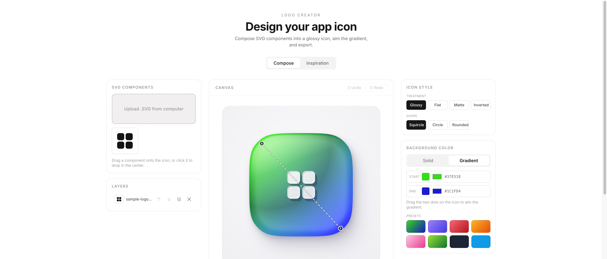

# Logo Studio

Compositional SVG logo design tool. Drop in SVG parts, arrange them on a canvas, style with solids or gradients, and export.



## Features

- SVG component palette — upload parts, then drag, scale, rotate
- Layers with reorder, snapping, undo/redo
- Solid and linear-gradient styling with draggable gradient handles
- Icon search across 200k+ glyphs (Iconify) — click to add
- Treatment and shape picker with live preview
- Export as SVG, PNG, or ZIP

## Run it

```bash
npm install
npm run dev
```

Open http://localhost:5180.

## Build

```bash
npm run build
```

## License

MIT — see [LICENSE](LICENSE).
